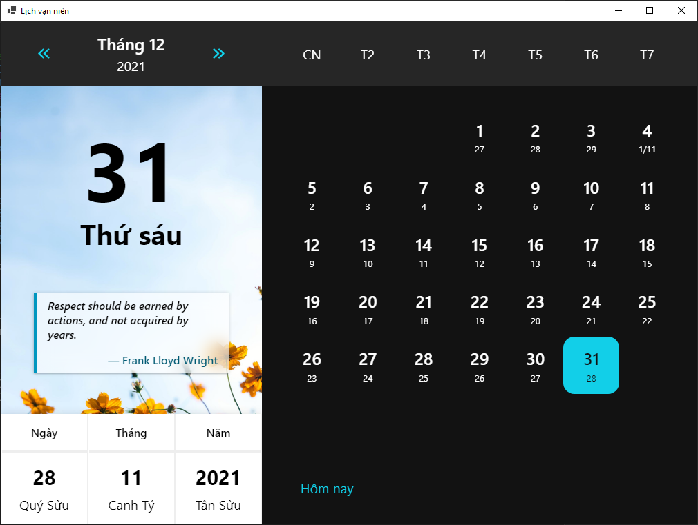

# Vietnamese Calendar

A Vietnamese calendar desktop app powered by [WebView2](https://developer.microsoft.com/en-us/microsoft-edge/webview2/) and [SvelteKit](https://kit.svelte.dev/).

## Screenshots



## Requirements
 - Windows operating system
 - NET 6.0 [download](https://dotnet.microsoft.com/en-us/download)
 - NodeJS and NPM [download](https://nodejs.org/en/download/)
 - WebView2 [download](https://developer.microsoft.com/en-us/microsoft-edge/webview2/)

## Developing

Once you've installed dependencies with `npm install` (or `pnpm install` or `yarn`), start a development server:

```bash
npm run dev
```

## Building

```bash
npm run build
```

> You can preview the built app with `npm run preview`. This should _not_ be used to serve your app in production. Use `bin\Release\net6.0-windows\publish` instead.
